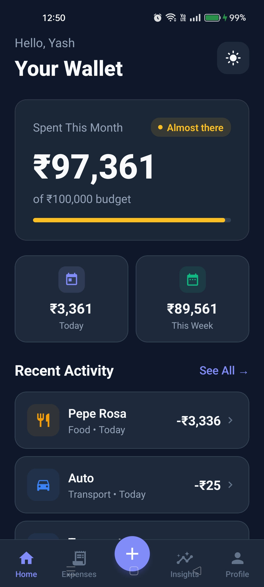
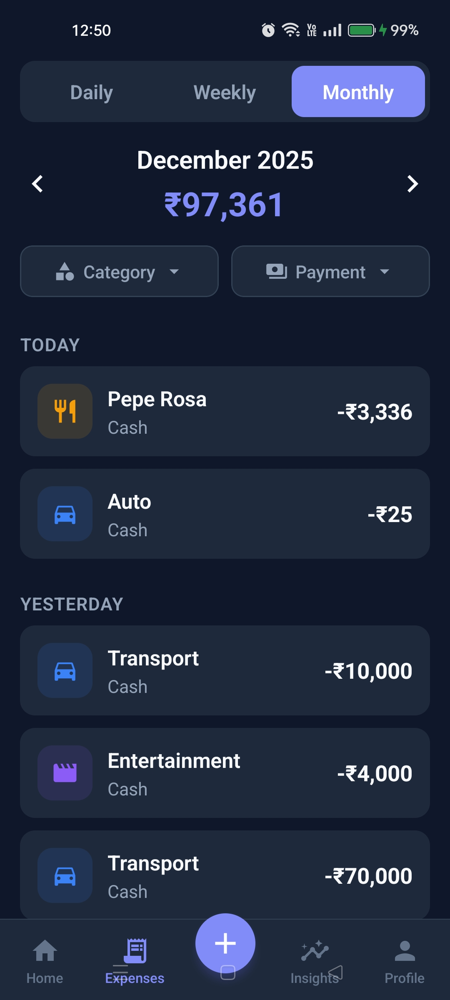
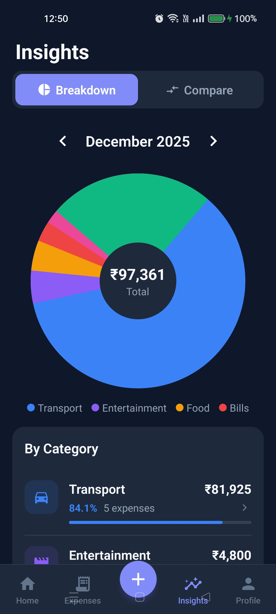
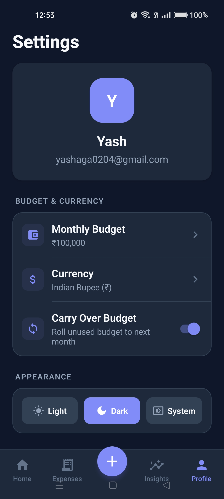
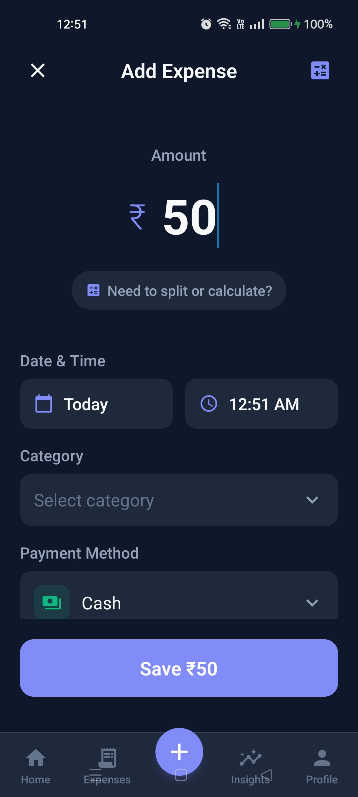
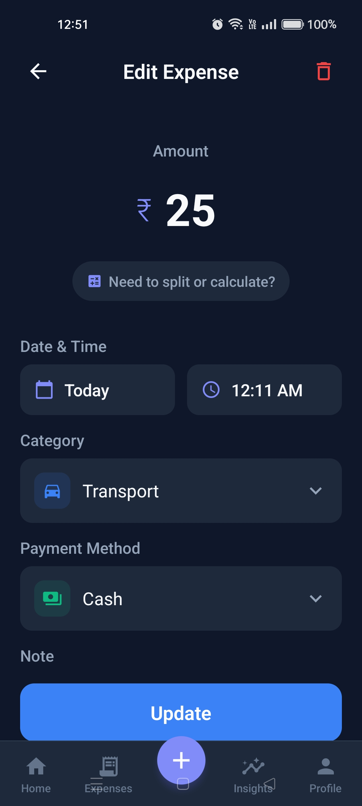
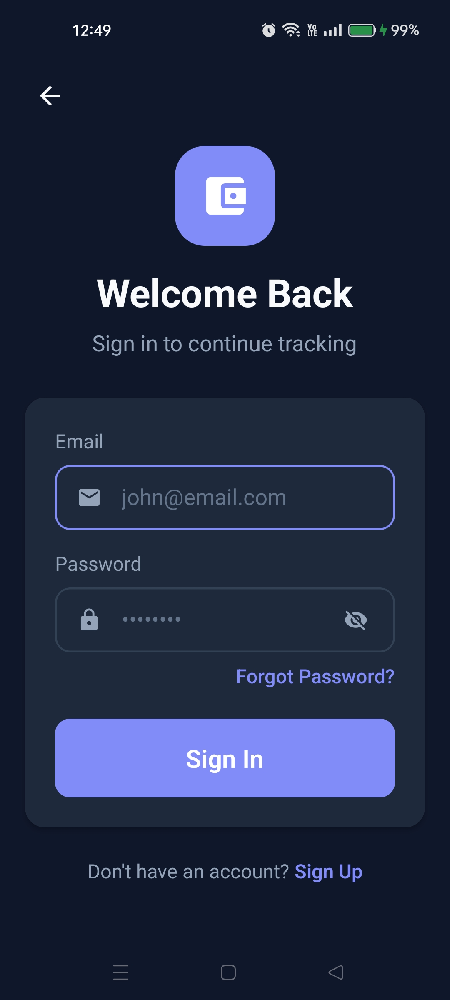
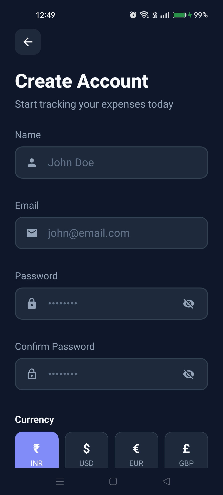

# Spendwise

A comprehensive expense and income tracking mobile application built with React Native and Expo, featuring offline-first architecture, split expense management, and rich analytics.

## Demo Video

[Watch Demo Here](https://youtu.be/z1iM71YODjk)

---

## Screenshots

<table>
  <tr>
    <td align="center"><br><b>Home</b></td>
    <td align="center"><br><b>Activity</b></td>
    <td align="center"><br><b>Insights</b></td>
    <td align="center"><br><b>Settings</b></td>
  </tr>
  <tr>
    <td align="center"><br><b>Add Transaction</b></td>
    <td align="center"><br><b>Edit Expense</b></td>
    <td align="center"><br><b>Login</b></td>
    <td align="center"><br><b>Register</b></td>
  </tr>
</table>

<!-- Placeholder for additional screenshots -->
<!-- 
<table>
  <tr>
    <td align="center"><br><b>Owes & Dues</b></td>
    <td align="center"><br><b>Recurring</b></td>
    <td align="center"><br><b>Categories</b></td>
    <td align="center"><br><b>Split Expense</b></td>
  </tr>
</table>
-->

---

## Key Features

### Expense & Income Management
- Add expenses with amount, category, payment method, description, and date
- Track income with multiple sources (Salary, Freelance, Investment, etc.)
- Edit and delete transactions with confirmation
- Built-in calculator for quick amount entry
- Real-time balance overview (Income vs Expenses)

### Split Expenses & Owes/Dues
- Split expenses among participants (equal, custom, or percentage-based)
- Track who owes you and whom you owe
- Mark payments as settled
- Edit participant details (name, phone)
- Send WhatsApp payment reminders with UPI details
- Swipe gestures for quick actions

### Categories
- 10+ predefined categories with custom icons and colors
- Create custom categories with personalized icons and colors
- Category-based filtering and analytics
- Visual icons for quick identification

### Recurring Transactions
- Set up recurring expenses and income (daily, weekly, monthly, yearly)
- Auto-generate transactions on schedule
- Pause/resume recurring items
- Manual generation for immediate processing

### Payment Methods
- 6 payment options: Cash, UPI, Credit Card, Debit Card, Net Banking, Wallet
- Filter expenses by payment method

### View Modes & Navigation
- Daily, Weekly, and Monthly expense views
- Date/week/month navigation with arrows
- Tab-based navigation (Home, Activity, Add, Insights, Profile)
- Pull-to-refresh functionality

### Insights & Analytics
- Pie chart visualization of spending by category
- Category breakdown with percentages and progress bars
- Historical trend bar charts (Last 7 days / 6 months / 3 years)
- Period comparison tool (compare days, months, or years)
- Smart insights with spending patterns analysis
- Click on category to filter expenses

### Budget Management
- Monthly budget setting with visual progress
- Budget status indicators (On Track, Almost there, Over Budget)
- Carry-over budget option (roll unused budget to next month)
- Budget warnings at 75% and 90% usage

### Export & Reports
- Export transactions to CSV format
- Export detailed PDF reports
- Date range selection for exports
- Filter by transaction type (expenses, income, or both)
- Access from Profile → Export Data

### Settings & Preferences
- Multi-currency support (INR, USD, EUR, GBP, JPY, AUD, CAD)
- UPI ID configuration for payment reminders
- Theme options: Light, Dark, System (auto)
- Quick access to Owes/Dues, Recurring, Categories, and Export

### Offline Support (Offline-First Architecture)
- Automatically saves transactions offline when network is unavailable
- Caches expenses, income, and balance data locally
- Auto-sync pending changes when connection is restored
- Local balance calculation when server is unreachable
- Graceful error handling with informative messages
- Works seamlessly without manual intervention

### Authentication
- User registration with name, email, password, and currency preference
- Secure login with JWT tokens
- Persistent sessions with AsyncStorage
- Logout functionality with confirmation

---

## Tech Stack

### Frontend
- **React Native** with **Expo** (SDK 52)
- **Expo Router** (file-based routing with tabs)
- **React Context** (state management)
- **AsyncStorage** (local persistence & caching)
- **TypeScript** (type safety)
- **React Native Gesture Handler** (swipe actions)
- **React Native Reanimated** (animations)

### Backend
- **Node.js** with **Express**
- **MongoDB** with **Mongoose**
- **JWT Authentication**
- **bcrypt** (password hashing)
- **Rate Limiting** (express-rate-limit)
- **Helmet** (security headers)
- **CORS** (cross-origin support)

---

## Project Structure

```
Spendwise/
├── app/
│   ├── (auth)/              # Authentication screens
│   │   ├── _layout.tsx
│   │   ├── landing.tsx
│   │   ├── login.tsx
│   │   ├── register.tsx
│   │   └── welcome.tsx
│   ├── (main)/              # Main app screens
│   │   ├── _layout.tsx      # Tab navigation
│   │   ├── home.tsx         # Dashboard
│   │   ├── expenses.tsx     # Activity list
│   │   ├── insights.tsx     # Analytics
│   │   ├── profile.tsx      # Settings
│   │   ├── add-transaction.tsx
│   │   ├── edit-expense.tsx
│   │   ├── edit-income.tsx
│   │   ├── categories.tsx   # Category management
│   │   ├── recurring.tsx    # Recurring transactions
│   │   └── owes-dues.tsx    # Split expense tracking
│   ├── _layout.tsx          # Root layout
│   └── index.tsx            # Entry point
├── components/              # Reusable components
│   ├── ui/                  # UI components (Card, Button, etc.)
│   ├── SplitModal.tsx       # Split expense modal
│   ├── ExportModal.tsx      # Export dialog
│   ├── FilterModal.tsx      # Filter options
│   ├── SmartInsightsCard.tsx
│   ├── Toast.tsx
│   └── ...
├── utils/                   # Utilities
│   ├── api.ts               # API client
│   ├── offlineSync.ts       # Offline data management
│   ├── budgetNotification.ts
│   ├── ThemeContext.tsx     # Theme provider
│   ├── theme.ts             # Theme definitions
│   └── ...
├── server/                  # Backend API
│   ├── models/              # Mongoose models
│   ├── routes/              # API routes
│   │   ├── auth.routes.js
│   │   ├── expense.routes.js
│   │   ├── income.routes.js
│   │   ├── category.routes.js
│   │   ├── recurring.routes.js
│   │   ├── budget.routes.js
│   │   ├── export.routes.js
│   │   └── ai.routes.js
│   ├── middleware/          # Express middleware
│   └── server.js            # Entry point
├── screenshots/             # App screenshots
├── .github/                 # GitHub Actions CI/CD
├── k8s/                     # Kubernetes configs
└── terraform/               # Infrastructure as Code
```

---

## Environment Variables

### Frontend (.env)

```env
EXPO_PUBLIC_API_URL=http://YOUR_IP:3000/api
```

| Variable              | Description                                              |
| --------------------- | -------------------------------------------------------- |
| `EXPO_PUBLIC_API_URL` | Backend API base URL. Use your local IP for development. |

### Backend (server/.env)

```env
MONGODB_URI=mongodb://localhost:27017/spendwise
JWT_SECRET=your_secret_key_here
PORT=3000
```

| Variable      | Description                      |
| ------------- | -------------------------------- |
| `MONGODB_URI` | MongoDB connection string        |
| `JWT_SECRET`  | Secret key for JWT token signing |
| `PORT`        | Server port (default: 3000)      |

---

## API Endpoints

### Authentication
| Method | Endpoint             | Description       |
| ------ | -------------------- | ----------------- |
| POST   | `/api/auth/register` | Register new user |
| POST   | `/api/auth/login`    | User login        |

### User Profile
| Method | Endpoint             | Description         |
| ------ | -------------------- | ------------------- |
| GET    | `/api/users/profile` | Get user profile    |
| PUT    | `/api/users/profile` | Update user profile |

### Expenses
| Method | Endpoint                  | Description           |
| ------ | ------------------------- | --------------------- |
| GET    | `/api/expenses`           | Get all expenses      |
| POST   | `/api/expenses`           | Create expense        |
| PUT    | `/api/expenses/:id`       | Update expense        |
| DELETE | `/api/expenses/:id`       | Delete expense        |
| POST   | `/api/expenses/sync`      | Sync multiple expenses|
| GET    | `/api/expenses/daily`     | Daily summary         |
| GET    | `/api/expenses/monthly`   | Monthly summary       |
| GET    | `/api/expenses/category`  | Category summary      |
| GET    | `/api/expenses/insights`  | Spending insights     |

### Income
| Method | Endpoint              | Description         |
| ------ | --------------------- | ------------------- |
| GET    | `/api/income`         | Get all income      |
| POST   | `/api/income`         | Create income       |
| PUT    | `/api/income/:id`     | Update income       |
| DELETE | `/api/income/:id`     | Delete income       |
| GET    | `/api/income/sources` | Get income sources  |
| GET    | `/api/income/summary` | Income summary      |
| GET    | `/api/income/balance` | Income vs Expenses  |

### Categories
| Method | Endpoint              | Description          |
| ------ | --------------------- | -------------------- |
| GET    | `/api/categories`     | Get all categories   |
| POST   | `/api/categories`     | Create category      |
| PUT    | `/api/categories/:id` | Update category      |
| DELETE | `/api/categories/:id` | Delete category      |

### Recurring Transactions
| Method | Endpoint                      | Description              |
| ------ | ----------------------------- | ------------------------ |
| GET    | `/api/recurring`              | Get recurring items      |
| POST   | `/api/recurring`              | Create recurring         |
| PUT    | `/api/recurring/:id`          | Update recurring         |
| DELETE | `/api/recurring/:id`          | Delete recurring         |
| POST   | `/api/recurring/:id/toggle`   | Pause/resume             |
| POST   | `/api/recurring/:id/generate` | Generate transaction     |
| POST   | `/api/recurring/process`      | Process all due items    |

### Budget
| Method | Endpoint              | Description         |
| ------ | --------------------- | ------------------- |
| GET    | `/api/budgets`        | Get budgets         |
| POST   | `/api/budgets`        | Set budget          |
| GET    | `/api/budgets/status` | Budget status       |

### Export
| Method | Endpoint          | Description       |
| ------ | ----------------- | ----------------- |
| GET    | `/api/export/pdf` | Export as PDF     |
| GET    | `/api/export/csv` | Export as CSV     |

---

## Installation

### Prerequisites

- Node.js (v18+)
- MongoDB (v6+)
- Expo CLI (`npm install -g expo-cli`)
- Expo Go app (for mobile testing)

### Setup

1. **Clone the repository**

   ```bash
   git clone https://github.com/Yash020405/Spendwise.git
   cd Spendwise
   ```

2. **Install frontend dependencies**

   ```bash
   npm install
   ```

3. **Install backend dependencies**

   ```bash
   cd server
   npm install
   cd ..
   ```

4. **Configure environment variables**

   Create `.env` in root directory:

   ```env
   EXPO_PUBLIC_API_URL=http://YOUR_LOCAL_IP:3000/api
   ```

   Create `.env` in server directory:

   ```env
   MONGODB_URI=mongodb://localhost:27017/spendwise
   JWT_SECRET=your_secret_key
   PORT=3000
   ```

5. **Start MongoDB**

   ```bash
   mongod
   ```

6. **Start the backend server**

   ```bash
   cd server
   npm run dev
   ```

7. **Start the Expo development server**

   ```bash
   npx expo start
   ```

8. **Scan QR code** with Expo Go app to run on your device

---

## Future Roadmap

### v2.0 - Smart Features
- [ ] Receipt scanning with OCR
- [ ] AI-powered spending predictions
- [ ] Smart categorization suggestions
- [ ] Push notifications for budget alerts
- [ ] Home screen widgets
- [ ] Biometric app lock (fingerprint/face ID)

### v3.0 - Social & Collaboration
- [ ] Shared family/group accounts
- [ ] Multi-user split expense collaboration
- [ ] Expense requests and approvals
- [ ] Social payment integrations

### v4.0 - Financial Planning
- [ ] Savings goals and tracking
- [ ] Investment portfolio overview
- [ ] Bill reminders and due dates
- [ ] Financial health score
- [ ] Subscription management

---

## Contributing

1. Fork the repository
2. Create your feature branch (`git checkout -b feature/amazing-feature`)
3. Commit your changes (`git commit -m 'Add some amazing feature'`)
4. Push to the branch (`git push origin feature/amazing-feature`)
5. Open a Pull Request

---

## License

This project is licensed under the MIT License - see the [LICENSE](LICENSE) file for details.

---

## Author

**Yash Agarwal**
- GitHub: [@Yash020405](https://github.com/Yash020405)
